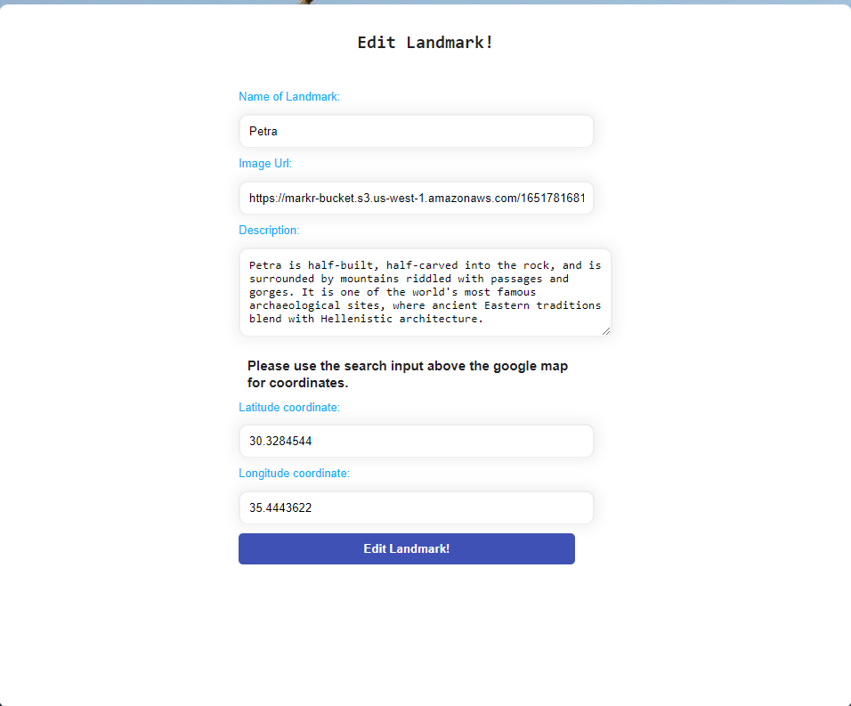

# Markr

- Geocoding API
- Maps JavaScript API
- Places API

Inspired by [Flickr](https://www.flickr.com), Markr is a Landmark sharing app where people can post their favorite landmarks. Users can also interact with other user's landmark post by putting reviews and suggestions.

All features update the page the user is on without a refresh of the page through use of the Redux store.

- [Live Site](https://mark-r.herokuapp.com/)
- [MVP Feature List](https://github.com/jrbauti-09/markr/wiki/MVPs)
- [Database Schema](https://github.com/jrbauti-09/markr/wiki/Database-Schema)

# Technologies Used

## Hosting

 

## Backend

  

## Frontend

  

## Additional React Libraries used

- [@react-google-maps/api](https://www.npmjs.com/package/@react-google-maps/api)

- [use-places-autocomplete](https://www.npmjs.com/package/use-places-autocomplete)

- [@reach/combobox](https://www.npmjs.com/package/@reach/combobox)

- [react-toastify](https://www.npmjs.com/package/react-toastify)

## Documentation used for google API

https://react-google-maps-api-docs.netlify.app/

https://developers.google.com/maps/documentation/javascript/places-autocomplete

# Getting started

1. Clone this repository

   `git clone https://github.com/jrbauti-09/markr.git`

2. CD into the backend directory and install dependencies

   `npm install`

3. CD into the frontend directory and install dependencies

   `npm install`

4. Create a .env file based on the .env.example given

5. Create a user in psql based on your .env DB_USERNAME

   `psql -c "CREATE USER <username> PASSWORD '<password>' CREATEDB"`

6. Create the database, migrate, and seed

   `npx dotenv sequelize db:create`

   `npx dotenv sequelize db:migrate`

   `npx dotenv sequelize db:seed:all`

7. Open up two terminals and cd into the backend and frontend directories, respectively. Start the server in each by running:

   `npm start`

# Features

## Splash Page & User Authentication

Users can log into an existing account or sign up. Alternatively, users can test the site with the Demo Login feature.

## User Explore/Collections Page

### Navigation

- The active tab that is currently being displayed is shown on the navigation bar.

Once the user is logged in, they can view all Landmarks posted on the app.

- Hovering over landmarks creates a transition letting the user know which landmark is in focus.
- Clicking on a landmark will display a zoomed in modal of that landmark, with a navigation button that directs the user to the landmark details tab.

A user can post a new landmark by clicking "Post landmark" in the navigation bar.

- Edit and delete buttons only for users that own the landmark post.

This feature is available on the Collections tab which can be viewed by clicking "Your Landmarks" in the navigation bar.

## Landmark Form

Users can post their favorite landmarks via the "Post landmark" tab. The landmark form includes:

- Landmark name input
- Image file upload via AWS hosting
- Description of their favorite landmark
- An address search bar which uses Places API to autocomplete and list address options for user.

- AWS upload, image files. .png .jpg etc.
  
- User can also delete their Landmarks on the "Your landmarks" tab.
  

## Landmark Details and Reviews

When user clicks on a landmark on either the "Your Landmarks" tab or the "Explore" tab they have the option to go to the details page of that specific landmark. After clicking the map logo they are directed to the details page which contain:

- Landmark reviews posted by user or other users in the community.
- Description of Landmark and date of post.
- User who posted Landmark.
- Image of the Landmark posted.
- Interactive google map which the user can explore with to discover other places they might stumble upon!

- User can add a review clicking the icon below the Landmark Reviews
  
- User can post a review
  
- User can edit their form
  

## Search

When posting/editing a Landmark, users can search landmark address for latitude and longitude coordinates.

Search coverage: Entire world map

### Google Maps API

- Maps Java script API
  - Unlimited requests per day.
  - 30,000 loads per minute.
  - 300 loads per minute per user.
  - Shows surrounding details via customized radius view option(object).
- Geocoding API
  - Provides geocoding and reverse geocoding of addresses based on user's input.
  - Converts user's address input into geographic coordinates (like latitude and longitude) via getGeocode in the usePlacesAutoComplete react library.
- Places API
  - Integrated with Geocoding API (reverse geocoding of address).
  - Map will pan to location based on user's input.
  - Place Search returns list of places based on a user's location or search string.
  - Place Autocomplete automatically fills in the name and/or address of a place as users type.
  - Place photos provides access to the millions of place-related photos stored in Google's Place database.

- Shows address options for users as they type.

- Pans map to selected option.

- Can fetch images around location via google api.

- Automatically fills in geographic coordinates for user's landmark form.

- Can show surrounding details around centered location.

## Upcoming Features

- Ability for user to filter their landmark explore page based on the desired region. (North America, South America, Europe, Asia, Africa etc.)
- User profile page which can have comments and ratings.
- Ability to message other users in the application.
- Ratings for Landmark posts.
